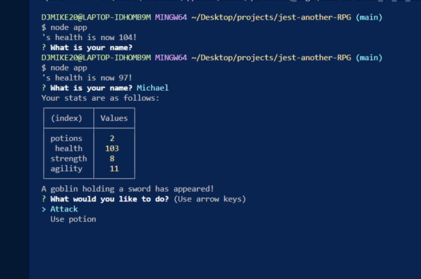
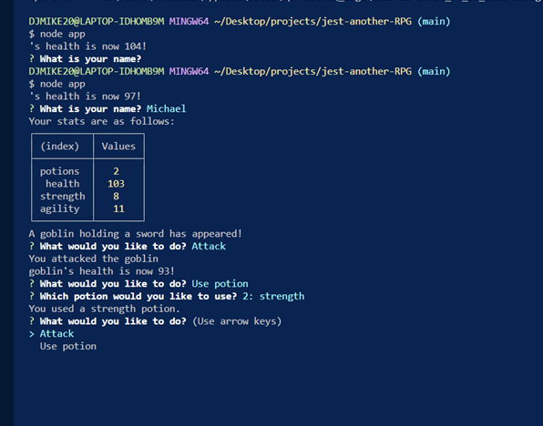
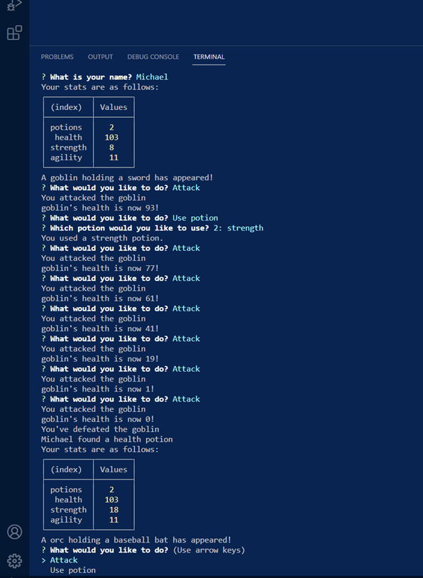

# jest-another-RPG

## Description
  Jest-Another-RPG, a command-line role-playing game application in which in which the user battles a series of enemies whose health and stats can be sustained by taking a potion. The game will create new objects using JavaScript constructor functions, and implement basic code tests using the Jest framework, and Inquirer for command questions. A OOP and TDD application.
## Table of Contents 
  * [Installation](#installation)
  * [Usage](#usage)
  * [Important-Links](#Important-Links)
  * [Questions](#questions)

  ## Installation
  * Ensure you are in your root folder,then open terminal and clone code from github. Then run these in the command terminal:

  * Next, run "npm init -y" to install packages 
  * Jest Setup - "npm i jest" > 
  * Inquirer > "npm i inquirer" 

   ## Usage 

  * Firstly, open the terminal 
  
  * To test the functions "npm run test"
  * Then to run the application in terminal use: "node app"
  

   

   
 
   

 ## Important Links 
* GitHub Link: https://github.com/MichaelZimm20/jest-another-RPG

## Questions 
  If you have any questions or concerns, contact:
  * GitHub: [MichaelZimm20](https://github.com/MichaelZimm20)